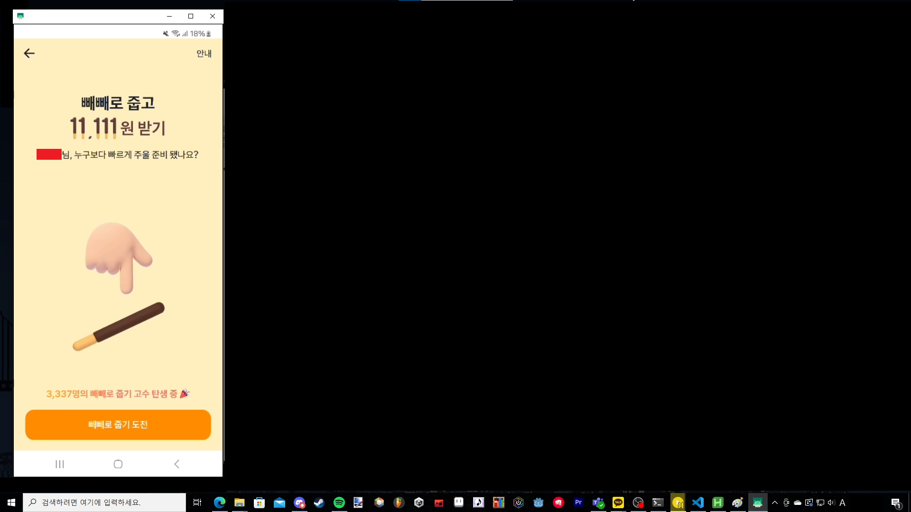

# tossmacro-pepero

토스 빼빼로 이벤트 매크로

## 준비물

1. **scrcpy**: Android 화면 미러링을 위해 [scrcpy](https://github.com/Genymobile/scrcpy)를 설치해야 합니다.
2. **개발자 모드 및 USB 디버깅 활성화**: 스마트폰과 컴퓨터를 연결하고 개발자 모드와 USB 디버깅을 활성화해주세요. [참고 가이드](https://m.blog.naver.com/dsmobile3550/221299587135).

## 사용법

1. scrcpy를 설치한 위치에서 터미널을 열고 다음 명령어로 ADB 연결을 확인합니다.

2. 아래 명령어를 실행해 스마트폰 화면을 컴퓨터에 미러링합니다.
     ```bash
     scrcpy -d -m800 -b2M
     ```

3. 다음 이미지와 동일하게 scrcpy 창의 위치와 크기를 설정합니다. 
   - 
   - 위 이미지를 다운받고 전체 화면으로 띄운 뒤, 미러링 창의 크기와 위치를 맞춰주세요.

4. 터미널에서 `macro.py`를 실행합니다.
     ```bash
     python macro.py
     ```

## 주의사항

* 안드로이드 스마트폰과 Windows 10 환경을 기준으로 설명되었습니다.
* 이 매크로는 상황에 따라 실패할 가능성이 있으며, 100%의 적중률을 보장하지 않습니다.